# Studioku.jogja Website

Website reservasi studio foto untuk Studioku Jogja. Dibangun menggunakan React untuk frontend dan Express.js + MySQL untuk backend. Website ini memungkinkan user untuk melihat paket layanan, galeri, testimoni, dan melakukan booking online. Admin dapat mengelola semua konten dan jadwal studio melalui dashboard admin.

## Struktur Proyek
- `frontend/` – Aplikasi React (tampilan user & admin)
- `backend/` – API Express.js dengan Sequelize ORM ([Branch server_side](https://github.com/salmaarayyan/StudiokuWebsite/tree/server_side))
- `documentation/` – Diagram dan screenshot

## Tampilan Website

### Halaman User

#### Dashboard
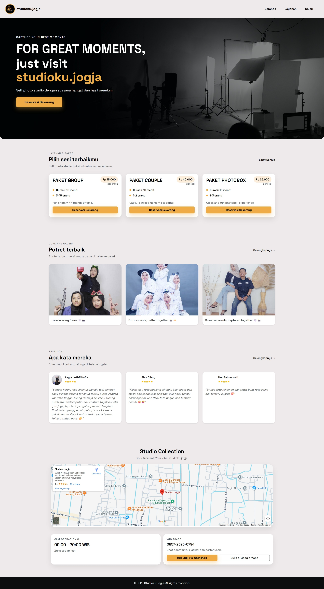
*User melihat halaman dashboard dengan menu navigasi*

#### Halaman Layanan
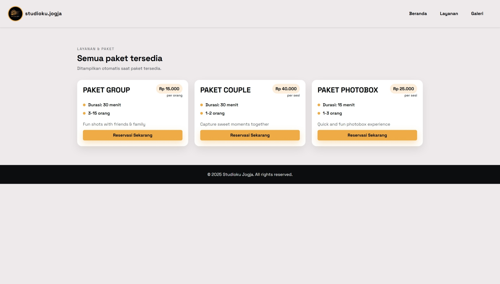
*User melihat daftar paket layanan yang tersedia*

#### Halaman Testimoni

*User melihat testimoni dari customer lain*

#### Proses Reservasi - Langkah 1
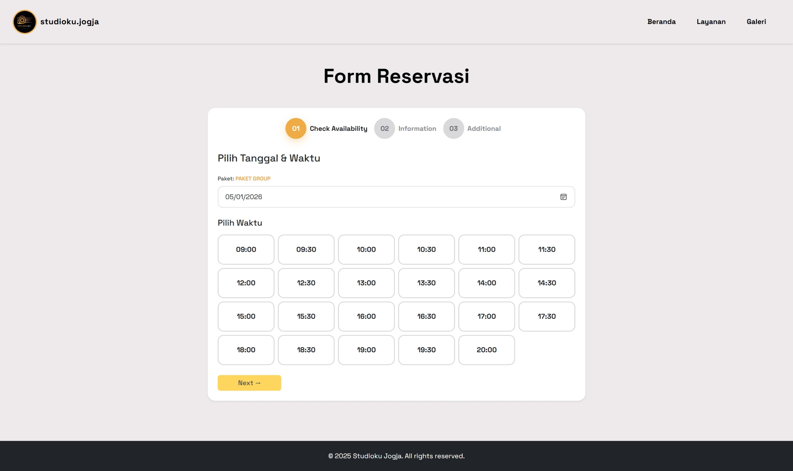
*User memilih paket dan tanggal booking*

#### Proses Reservasi - Langkah 2
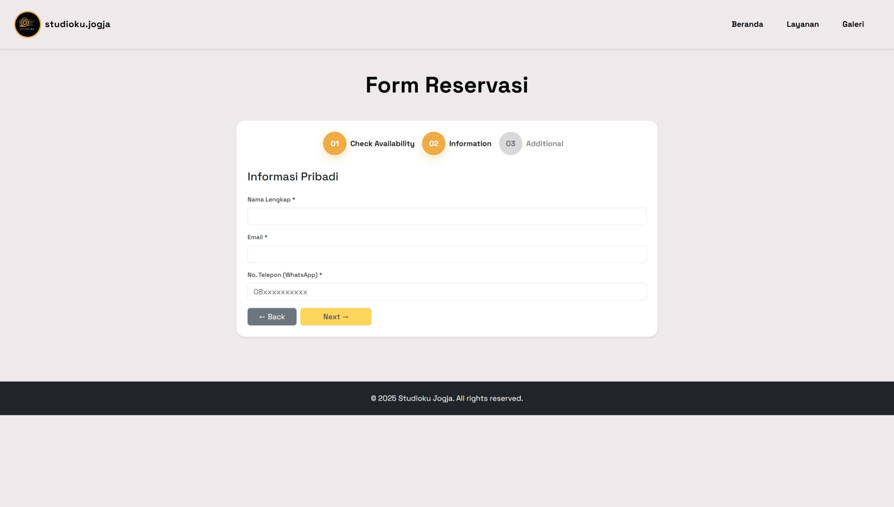
*User memilih waktu dan mengisi data diri*

#### Proses Reservasi - Langkah 3
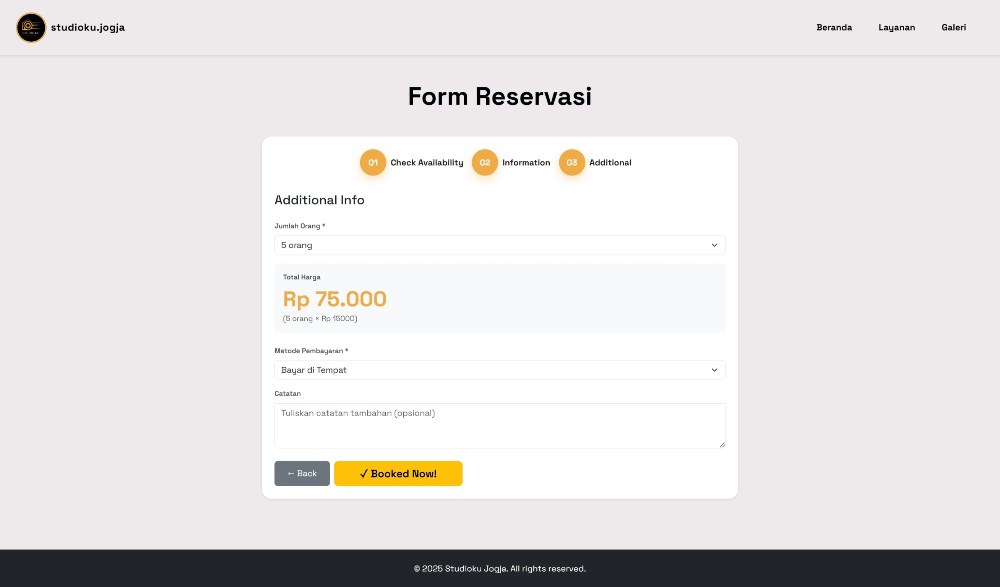
*User melengkapi informasi booking dan konfirmasi*

#### Berhasil Reservasi
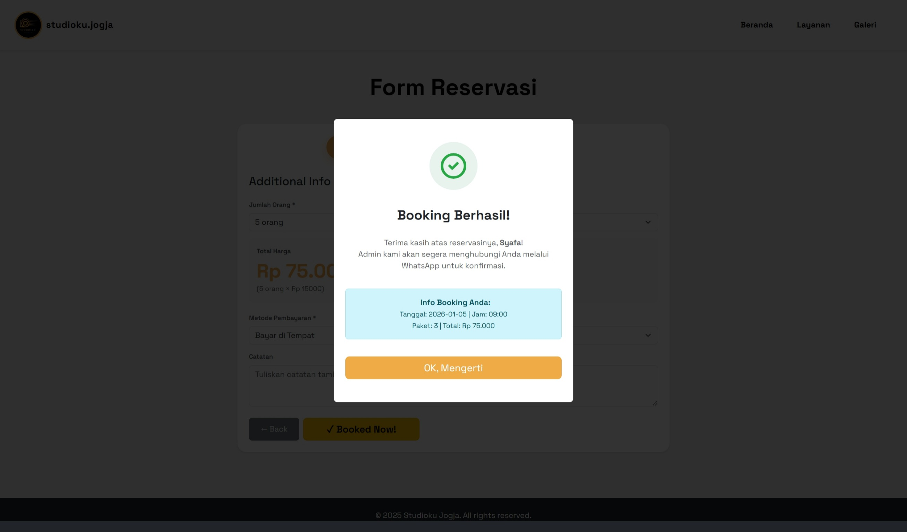
*Notifikasi sukses setelah booking berhasil dibuat*

### Halaman Admin

#### Login Admin
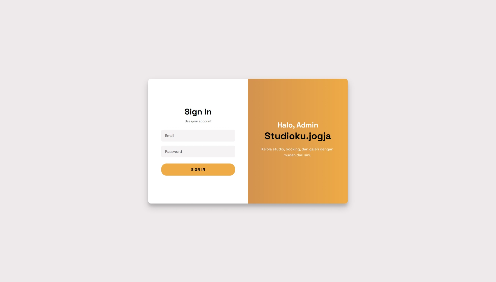
*Admin melakukan login ke dashboard*

#### Dashboard Admin
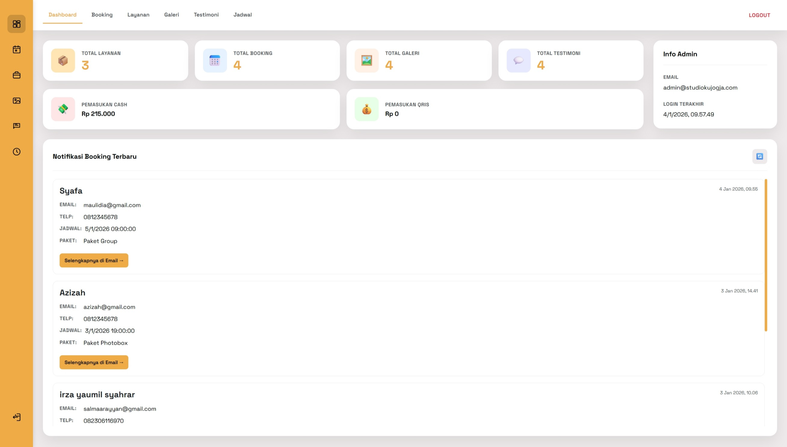
*Admin melihat dashboard dengan ringkasan booking*

#### Kelola Layanan
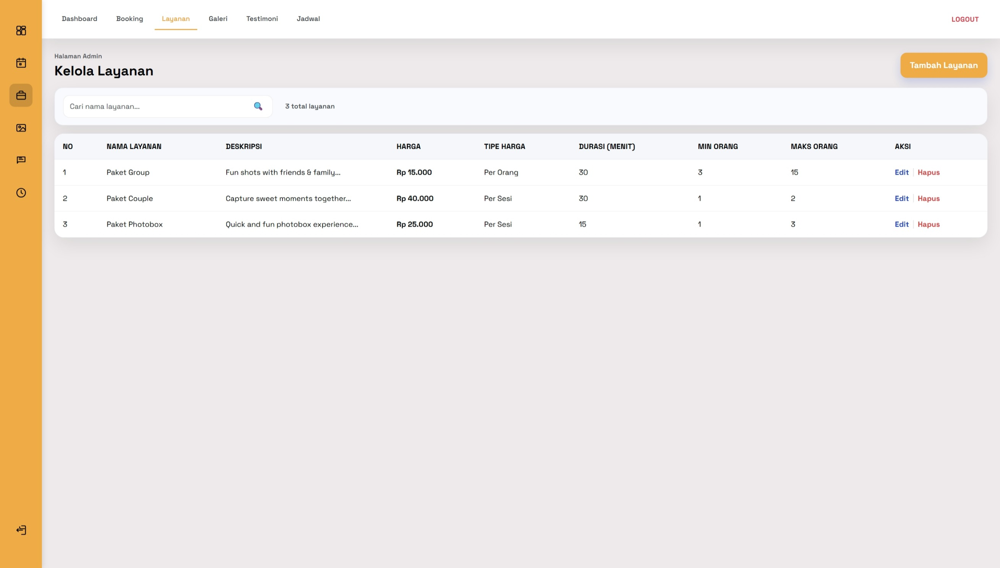
*Admin mengelola paket layanan (tambah, edit, hapus)*

#### Kelola Galeri
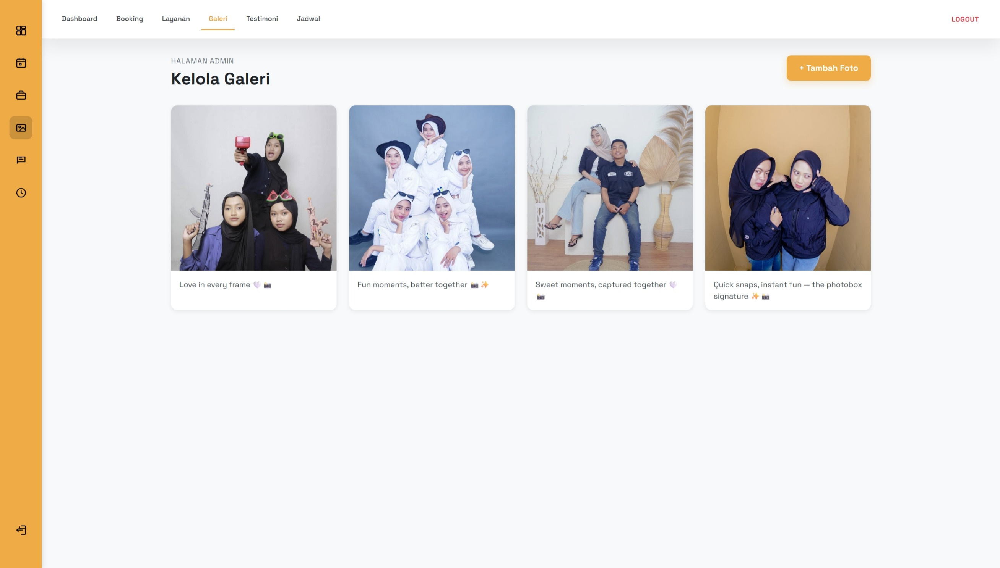
*Admin mengelola foto galeri studio*

#### Kelola Testimoni
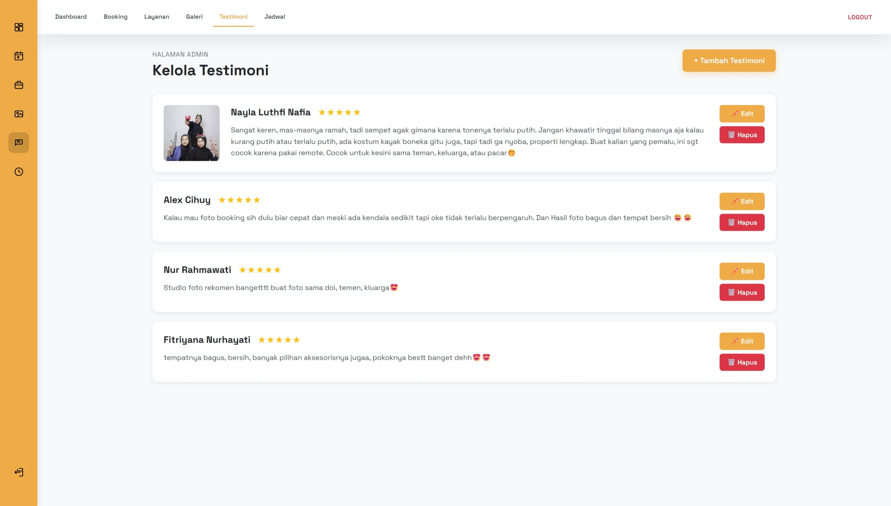
*Admin mengelola testimoni dari customer*

#### Kelola Booking
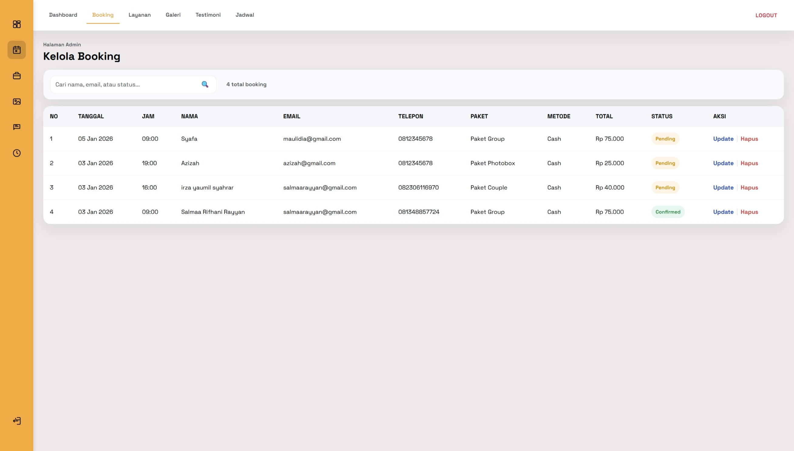
*Admin melihat dan mengelola daftar booking*

#### Kelola Jadwal
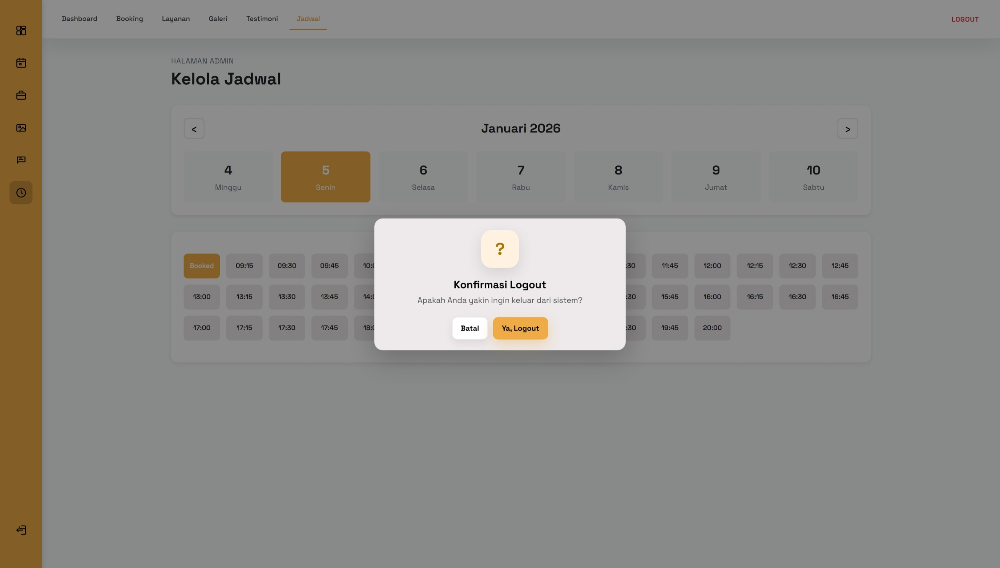
*Admin mengatur jadwal blokir (tidak tersedia)*

#### Logout Admin
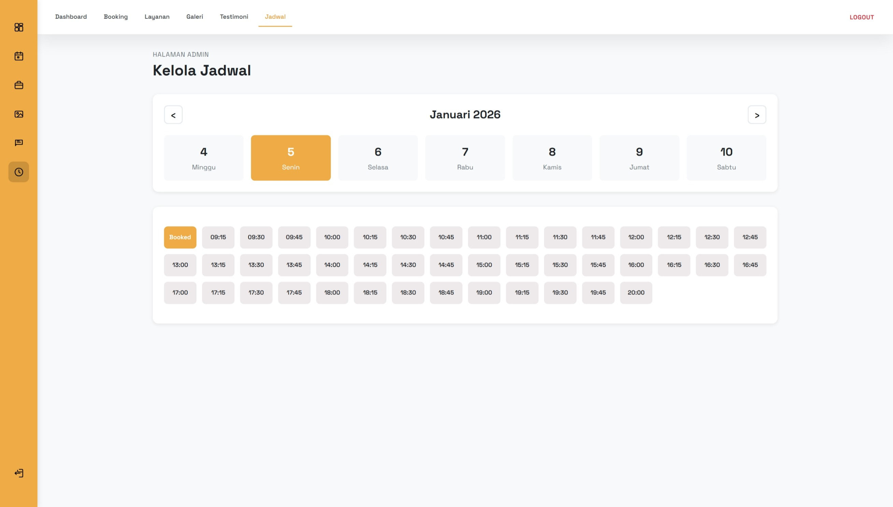
*Admin melakukan logout dari sistem*

## Fitur Utama

### Untuk User:
- Lihat paket layanan dengan harga dan deskripsi
- Lihat galeri foto hasil studio
- Lihat testimoni dari customer lain
- Booking online dengan pilih tanggal dan waktu
- Pilih background (khusus paket selain photobox)
- Notifikasi booking sukses via email

### Untuk Admin:
- Login ke dashboard admin
- Kelola layanan (tambah, edit, hapus paket)
- Kelola galeri foto
- Kelola testimoni customer
- Lihat dan update status booking
- Blokir jadwal untuk maintenance atau event khusus
- Notifikasi booking baru

## Cara Instalasi

### Yang Dibutuhkan
Pastikan sudah terinstal:
- **Node.js** versi 18 atau lebih baru ([Download di sini](https://nodejs.org/))
- **MySQL** (MySQL Workbench atau command line)
- **Git** untuk clone repository

### Langkah 1: Clone Repository
```bash
git clone https://github.com/salmaarayyan/StudiokuWebsite.git
cd StudiokuWebsite
```

### Langkah 2: Checkout Branch Backend
Backend berada di branch terpisah:
```bash
git checkout server_side
```
Setelah itu, folder `backend/` akan muncul.

### Langkah 3: Buat File yang Diperlukan

#### File .env di Backend
Buat file baru bernama `.env` di dalam folder `backend/` dengan isi:

```
PORT=5000
DB_HOST=127.0.0.1
DB_PORT=3306
DB_USER=root
DB_PASS=your_password_here
DB_NAME=studioku_jogja

JWT_SECRET=your_jwt_secret
JWT_EXPIRES_IN=1d

EMAIL_HOST=smtp.gmail.com
EMAIL_PORT=587
EMAIL_USER=your_email@gmail.com
EMAIL_PASS=your_app_password
EMAIL_TO=admin@studiokujogja.com
```

**Catatan:** 
- Ganti `DB_PORT` sesuai port MySQL kamu (biasanya 3306)
- Ganti `DB_PASS` dengan password MySQL kamu
- Ganti `JWT_SECRET` dengan string random untuk keamanan
- Untuk email, gunakan App Password dari Gmail (bukan password login biasa)

### Langkah 4: Setup Database

#### 4.1 Buka MySQL dan Buat Database
Buka MySQL Workbench atau command line MySQL, lalu jalankan:
```sql
CREATE DATABASE studioku_jogja;
```

#### 4.2 Install Dependencies Backend
```bash
cd backend
npm install
```

#### 4.3 Jalankan Migrasi Database
Perintah ini akan membuat semua tabel yang dibutuhkan:
```bash
npx sequelize-cli db:migrate
```

#### 4.4 Jalankan Seeder (Buat Akun Admin)
Perintah ini akan membuat akun admin default:
```bash
npx sequelize-cli db:seed:all
```

**Akun Admin Default:**
- Email: `admin@studiokujogja.com`
- Password: `admin123`

#### 4.5 Jalankan Backend Server
```bash
npm run dev
```
Backend akan berjalan di `http://localhost:5000`

### Langkah 5: Setup Frontend

Buka terminal baru (jangan tutup terminal backend):

```bash
# Kembali ke branch master untuk frontend
git checkout master

cd frontend
npm install
npm start
```

Frontend akan terbuka otomatis di browser `http://localhost:3000`

## Troubleshooting

### Migrasi atau Seed Gagal
- Pastikan MySQL server sudah berjalan
- Cek kredensial database di file `.env` sudah benar
- Pastikan database `studioku_jogja` sudah dibuat
- Pastikan folder `migrations` dan `seeders` ada di folder backend

### Email Tidak Terkirim
- Pastikan semua variabel `EMAIL_*` di `.env` sudah diisi dengan benar
- Untuk Gmail, gunakan **App Password** bukan password biasa
- Aktifkan "Less secure app access" atau gunakan 2-Factor Authentication + App Password

### Port Sudah Digunakan
- Jika port 5000 sudah dipakai aplikasi lain, ganti `PORT` di file `.env` backend
- Jika port MySQL bentrok, ganti `DB_PORT` di file `.env`
- Jika port 3000 (frontend) bentrok, React akan otomatis menawarkan port lain

### Backend Tidak Terhubung ke Frontend
- Pastikan backend sudah running di `http://localhost:5000`
- Cek file `frontend/src/services/api.js`, pastikan base URL sudah benar
- Cek console browser (F12) untuk melihat error detail
